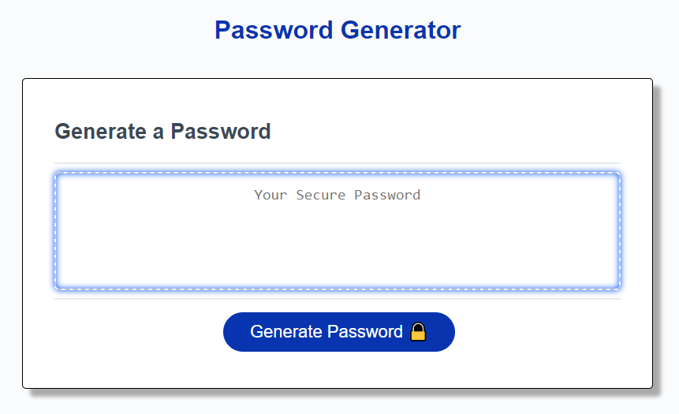

# Password Generator

## Description
This repo contains a random password generator web app. The porpuse of this project is to reenforce the usage of javascript and the logics behind it.

## Table of Contents 
- [What to expect](#what-to-expect)
- [Usage](#usage)
- [Contribute](#Contribute)
- [Credits](#credits)
- [Deployed application](#Deployed-application)

## What to expect
In this webpage, you will find:
- A not editable text box
- A password generator button
- Various prompts

## Usage

1. When the user clicks the button to generate a password, then a series of prompts are presented for password criteria.
2. The user is first prompted for password length. The user must only type a length of at least 8 characters and no more than 128 characters, otherwise the prompt will ask you for the length again until a valid value is input.
3. Then, the user is prompted for lowerCase characters to be included in the password or not.
4. Then, the user is prompted for upperCase characters to be included in the password or not.
5. Then, the user is prompted for numeric characters to be included in the password or not.
6. Then, the user is prompted for special characters to be included in the password or not.
7. When all prompts are answered, a password is generated that matches the selected criteria.
8. The password is written to the page in the not editable text box.

## Contribute
Optimize the code for it to run in fewer lines

## Credits
This project was posbile with the knowledge acquired in Tecnologico de Monterrey University Coding Bootcamp https://bootcamp.tec.mx/coding/ 

## Deployed application
https://stamm2911.github.io/Password-Generator/

